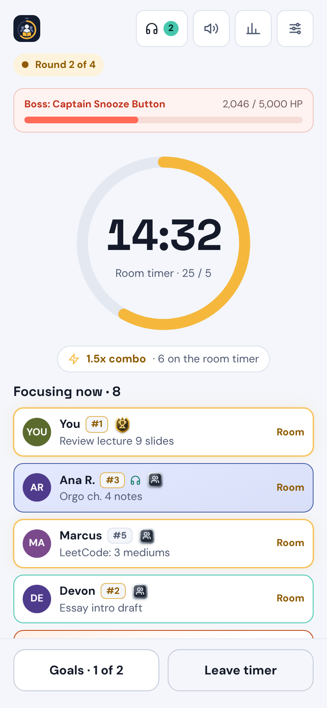
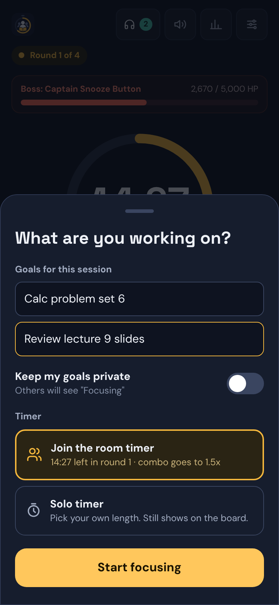
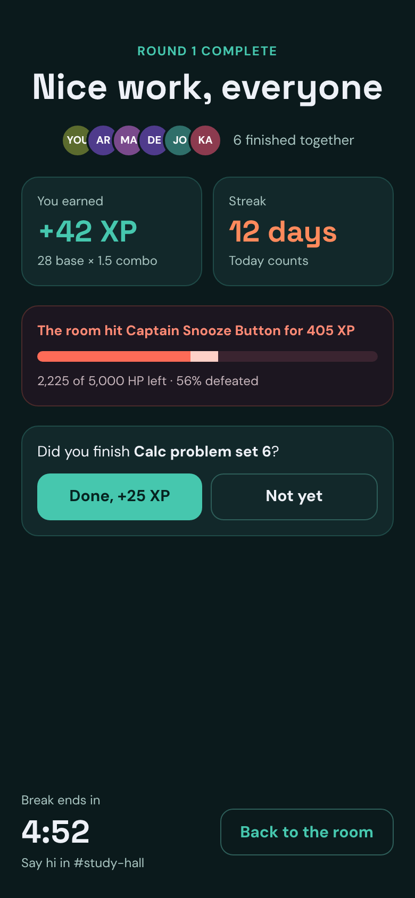
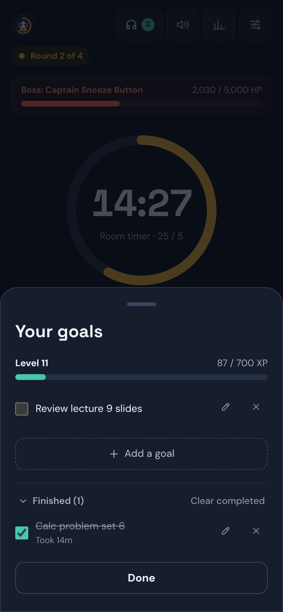
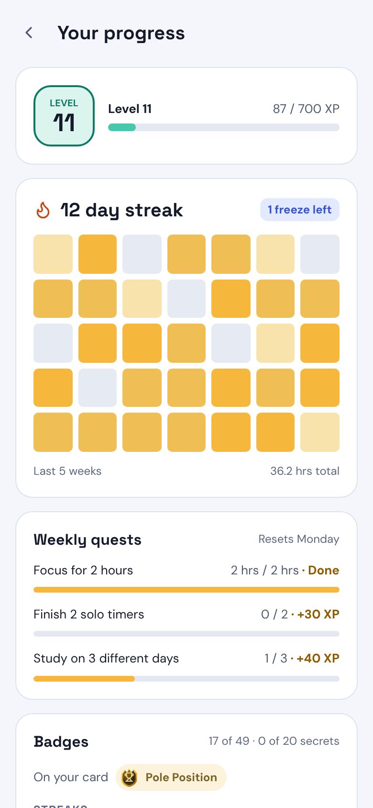
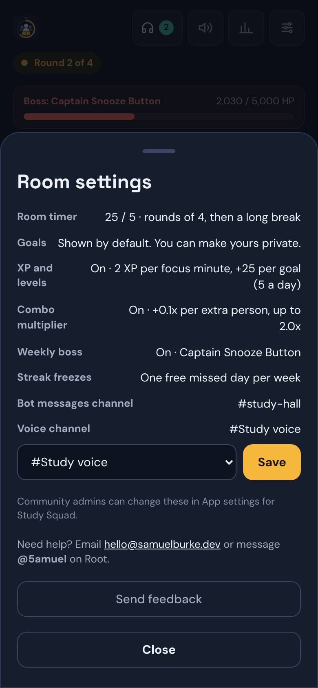
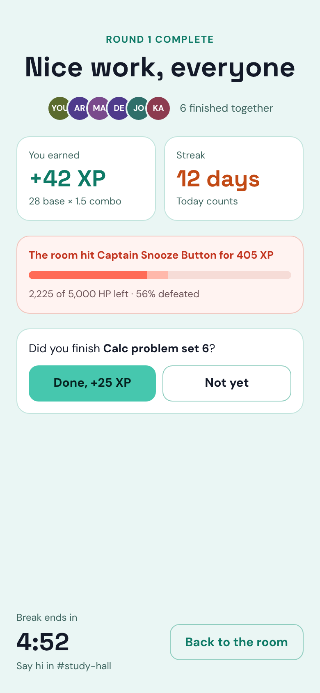
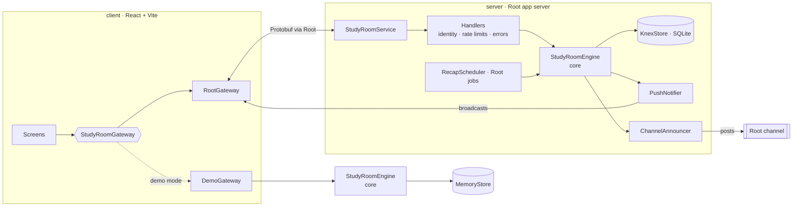

# Study Squad: Group Study Timer

**Focus together. See who's working, start a timer, keep your streak.**

Study Squad is a group study timer for [Root](https://www.rootapp.com) communities: a pomodoro-style focus timer you study together with, like a quiet library where you can see everyone else working. Join the room's shared timer, put a goal on the board, and when the round ends every screen celebrates and flips to break at the same moment.

<picture>
  <source media="(prefers-color-scheme: light)" srcset="docs/screenshots/room-desktop-light.png">
  
</picture>

<p>
  
  
  
  
</p>

<p>
  
  
  
  
</p>

## Features (v0.3.8)

- **Shared room timer** (25/5, 50/10 or custom, rounds of 4 with a long break) and **solo timers** that still show on the board
- **Live focus board**: who's focusing, on what, how long is left, their rank and who's in voice. Goals can be private ("Focusing")
- **No drift**: the server stores when a cycle started; every client derives the countdown (and the countdown chirps) from that and a measured clock offset
- **Goals list**: add, edit, drag to reorder (the top goal is the one on your card), and clear finished goals in one tap. Finished goals fold into one row and show how long they took. The first 5 goals finished each day pay +25 XP
- **Break moment**: XP earned, streak, damage dealt to the boss, and "did you finish your goal?"
- **Game layer**: XP and levels with no daily cap, a combo multiplier for focusing together, a weekly built-in boss with its own strength, weekly quests, 49 medals to collect (some secret) and card styles that unlock with level
- **Leaderboard** by focus minutes or XP, for this week, month, year or all time. Members can hide themselves
- **Streaks without guilt**: one finished session counts the day, one free freeze per week, and days start at 4am so late nights count
- **Keep going?** at the end of each cycle, so a forgotten timer can't farm XP all day
- **Voice**: admins pick the community's voice channel from a dropdown in Room settings. The room shows a Join voice button (it asks first) and headphones next to whoever is in the call
- **Channel posts**: daily recap, "room is busy", streak milestones, boss defeats, and a squad bot that cheers on the people studying. Bot @mentions are off by default, so names are plain text unless an admin turns pings on
- **Light and dark**: follows the theme picked in Root and switches live (the demo follows your device)
- **Send feedback** straight to the developer, anonymously, from Room settings
- **Admin settings** through Root's App settings (no custom admin UI to secure), plus the voice channel dropdown in Room settings
- **Delete my data** on the progress screen erases everything the app stores about you

See [DESIGN.md](DESIGN.md) for the reasoning behind each rule and [docs/API.md](docs/API.md) for the client/server contract.

## Try it without a Root account

The demo mode runs the real engine in your browser with a few simulated members:

```bash
npm install
```

```bash
npm run generate
```

```bash
npm run demo
```

Open the printed URL. Add `?focus=0.2&break=0.2` to make rounds 12 seconds long and see the break moment quickly.

The demo follows your device's light or dark setting. More URL settings for testing (boss nearly beaten, a long streak, replaying badge unlocks) are in [docs/TESTING.md](docs/TESTING.md). Merges to `main` deploy to Root on their own: see [docs/DEPLOYING.md](docs/DEPLOYING.md).

## Run it inside Root

1. Sign up at the [Root Developer Portal](https://dev.rootapp.com) and create an app. Its id is already in `root-manifest.json` (`"id"`). Use your own app id if you fork this.
2. Copy `.env.example` to `server/.env` and paste your dev token. Never commit it. To get **Send feedback** notes, also fill in the `FEEDBACK_RELAY_*` lines there before you build (notes go through the feedback relay to a private GitHub repo, see `docs/DEPLOYING.md`). The build bakes them into `server/dist/feedback.json`; without them the feedback box is hidden.
3. Start the server through Root's dev host, then the client:

```bash
npm run build
```

```bash
npm run server
```

```bash
npm run client
```

Requests route through Root's servers, so a valid `DEV_TOKEN` is required even locally.

## Scripts

| Command                 | What it does                                                            |
| ----------------------- | ----------------------------------------------------------------------- |
| `npm run generate`      | Generates client/server networking code from `networking/src/*.proto`   |
| `npm run verify`        | Format check, lint, typecheck, all unit and integration tests, build    |
| `npm test`              | Vitest across `core`, `contract`, `server`, `client`                    |
| `npm run test:coverage` | Same, with a coverage report in `coverage/`                             |
| `npm run test:e2e`      | Playwright against the demo build, desktop and phone profiles           |
| `npm run test:e2e:root` | Playwright against the real server on a fake Root host, several members |
| `npm run smoke:package` | Checks a built `rootapp.pkg` starts and carries current networking code |
| `npm run demo`          | Client with the in-browser engine and simulated members                 |
| `npm run server`        | Server through Root's dev host (needs `server/.env`)                    |
| `npm run client`        | Client dev server for use inside Root                                   |

The screenshots above come from the demo build. To retake them, run `npm run demo`, then `node scripts/readme-screenshots/capture.mjs` (it writes `docs/screenshots/`, dark and light). The App Store images have their own script in `scripts/store-screenshots/`.

## Architecture


```mermaid
flowchart LR
  subgraph Client [client · React + Vite]
    UI[Screens] --> GW{{StudyRoomGateway}}
    GW --> RG[RootGateway]
    GW -. demo mode .-> DG[DemoGateway]
  end
  subgraph Server [server · Root app server]
    SVC[StudyRoomService] --> H[Handlers<br/>identity · rate limits · errors]
    H --> E
    E --> KS[(KnexStore · SQLite)]
    E --> PN[PushNotifier]
    E --> CA[ChannelAnnouncer]
    J[RecapScheduler · Root jobs] --> E
  end
  E[StudyRoomEngine<br/>core]
  DG --> E2[StudyRoomEngine<br/>core] --> MS[(MemoryStore)]
  RG <-- Protobuf via Root --> SVC
  PN -- broadcasts --> RG
  CA -- posts --> CH[[Root channel]]
```

| Workspace     | Purpose                                                                                                                                    |
| ------------- | ------------------------------------------------------------------------------------------------------------------------------------------ |
| `core/`       | Pure TypeScript domain: timer math, XP, streaks, boss, quests, badges, settings, and the `StudyRoomEngine` use cases behind ports. No I/O. |
| `networking/` | Protobuf contract. `rootsdk build proto` generates `networking/gen/{client,server,shared}`.                                                |
| `contract/`   | Maps engine DTOs to the generated messages and back. One place, round-trip tested.                                                         |
| `server/`     | Root adapters: SQLite store, request handlers, broadcasts, channel posts, recap job.                                                       |
| `client/`     | React UI. Talks to a `StudyRoomGateway`, implemented for Root and for the in-browser demo.                                                 |

The layout follows Root's official `@rootsdk/create-root` template, with `core` and `contract` added so the rules can be tested without Root.

## Testing

- **core**: unit tests for every rule, plus engine scenarios with a fake clock (shared countdown, late joiners, downtime recovery, rollback on failure, caps, posts)
- **contract**: DTO → Protobuf → bytes → Protobuf → DTO round trips
- **server**: one `Store` contract suite run against both the in-memory store and SQLite; an integration test that fans broadcasts out to several clients through the wire format and checks they see the same timer and the same break; handler tests for identity, rate limits and error hygiene
- **client**: reducer and view helpers, and app tests that drive the real UI on the real engine
- **e2e**: Playwright on desktop and phone viewports, failing on any console error

## Design

The original mockups live in [docs/design](docs/design). Implementation choices that differ from them are listed in [DESIGN.md](DESIGN.md#where-the-app-differs-from-the-mockups).

## Support

Need help? Email [hello@samuelburke.dev](mailto:hello@samuelburke.dev) or message **@5amuel** on Root. More options are on the [support page](https://studysquad.samuelburke.dev/support/).

## Contributing and security

See [PRIVACY.md](PRIVACY.md) for what the app stores and how members delete it (also published at [studysquad.samuelburke.dev/privacy](https://studysquad.samuelburke.dev/privacy/), see [docs/WEBSITE.md](docs/WEBSITE.md)), [CONTRIBUTING.md](CONTRIBUTING.md) for the branch workflow and checks, [SECURITY.md](SECURITY.md) for how to report a vulnerability, and [CHANGELOG.md](CHANGELOG.md) for release notes.

## License

[MIT](LICENSE). Fonts in `client/src/assets/fonts` are under the SIL Open Font License (see `OFL.txt` there). The Root SDK packages are © Root Communications, Inc. and are installed from npm, not redistributed here.
